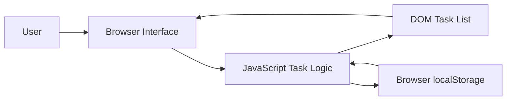
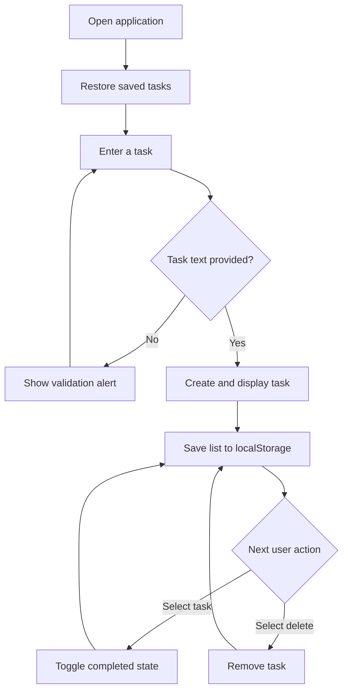

# ✅ To-Do List

A simple, responsive task-management application built with HTML, CSS, and  JavaScript. It helps users add, complete, and remove daily tasks while preserving their list in the browser through local storage.

## 📖 Overview

The To-Do List provides a focused interface for organizing everyday work without requiring an account, database, or server. All application logic runs directly in the browser, making the project lightweight, fast to load, and easy to deploy as a static website.

The application is well suited to beginners learning DOM manipulation, event handling, browser storage, and responsive interface design.

## ✨ Features

- Add new tasks to the list
- Mark tasks as completed or active
- Delete tasks that are no longer needed
- Preserve tasks after refreshing or reopening the page
- Validate empty task submissions
- Provide clear visual feedback for completed tasks
- Adapt to desktop and mobile screen sizes
- Run entirely in the browser with no backend dependency

## 🧰 Tech Stack

| Technology | Purpose |
| --- | --- |
| HTML5 | Defines the application structure and content |
| CSS3 | Provides layout, colors, responsive styling, and task states |
| JavaScript | Handles task creation, completion, deletion, and persistence |
| Web Storage API | Stores the task list in the browser using `localStorage` |

## 🌟 Project Highlights

- **Zero dependencies:** No frameworks, packages, or build tools are required.
- **Persistent state:** Tasks remain available across browser sessions.
- **Event delegation:** A single list listener handles both completion and deletion actions.
- **Instant updates:** User actions are reflected immediately without a page reload.
- **Static deployment:** The complete app can be hosted on any static-site platform.
- **Beginner-friendly codebase:** The compact structure makes the data flow easy to study and extend.

## 🏗️ System Architecture

The project follows a client-side architecture. The HTML document contains the interface, CSS controls presentation, and JavaScript coordinates user actions with the browser's local storage.



### 🧩 Main Components

| Component | Responsibility |
| --- | --- |
| Task input | Captures the text for a new task |
| Add button | Triggers task validation and creation |
| Task list | Displays active and completed tasks |
| Task click handler | Toggles the completed state of a task |
| Delete control | Removes a selected task |
| `saveData()` | Writes the current list markup to `localStorage` |
| `showTask()` | Restores saved tasks when the application loads |

## 🔄 Application Workflow



1. When the page loads, `showTask()` retrieves previously stored tasks.
2. The user enters task text and selects **Add**.
3. `addtask()` validates the input and creates a new list item.
4. Selecting a task toggles its `checked` CSS class.
5. Selecting the × control removes the corresponding task.
6. Every change calls `saveData()` to update `localStorage`.

## 📁 Project Structure

```text
To_Do_List-main/
├── to_do_list.html    # Markup, styles, and application logic
├── icon.png           # To-do list heading icon
├── checked.png        # Completed-task indicator
├── unchecked.png      # Active-task indicator
├── to_do_list_demo.mp4 # Application demonstration video
└── README.md           # Project documentation
```

## 🚀 Getting Started

### ✅ Prerequisites

A modern web browser such as Chrome, Edge, Firefox, or Safari is all that is required.

### 📥 Installation

1. Download or clone the project.
2. Keep the PNG assets in the same directory as `to_do_list.html`.
3. Open `to_do_list.html` in your browser.

No dependency installation or build command is necessary.

### 🖥️ Optional Local Server

The project can also be served locally:

```bash
python -m http.server 8000
```

Then open `http://localhost:8000/to_do_list.html`.

## 🎯 Usage

1. Type a task into the input field.
2. Select **Add** to place it on the list.
3. Select a task to mark it as completed; select it again to restore it.
4. Select the × icon beside a task to delete it.
5. Refresh the page to confirm that the saved list is restored.

> Task data is stored only in the current browser and origin. Clearing browser storage or using another device will not retain the list.

## 📸 Screenshots

### 🏠 Main Application


> Create a `screenshots` folder in the project directory and save the application screenshot as `todo-app.png`.

## 🎬 Demo Video

[▶️ Watch the To-Do List demonstration](to_do_list_demo.mp4)

> The video file must be named exactly `to_do_list_demo.mp4` and stored in the same directory as this README.

## 🔮 Future Improvements

- Support adding tasks with the Enter key
- Add task editing and confirmation before deletion
- Store structured task objects instead of HTML markup
- Introduce due dates, priorities, categories, and notes
- Add filters for all, active, and completed tasks
- Provide task counts and a clear-completed action
- Improve keyboard navigation and accessibility labels
- Add dark mode and customizable themes
- Synchronize tasks across devices through a backend API
- Include automated unit and user-interface tests

## 🙏 Acknowledgements

- The project uses standard browser APIs provided by modern web browsers.
- The checked, unchecked, and heading graphics are included as local project assets.
- Thanks to the web-development community for the learning resources and patterns that make beginner-friendly projects like this possible.

## 👨‍💻 Author

**Ravi Kumar Sharma**

Created as a frontend web-development project demonstrating DOM manipulation, event-driven JavaScript, and browser-based data persistence.

## 📄 License

This project is intended for educational and personal use. Add a `LICENSE` file before publishing or redistributing the project under a specific open-source license.
